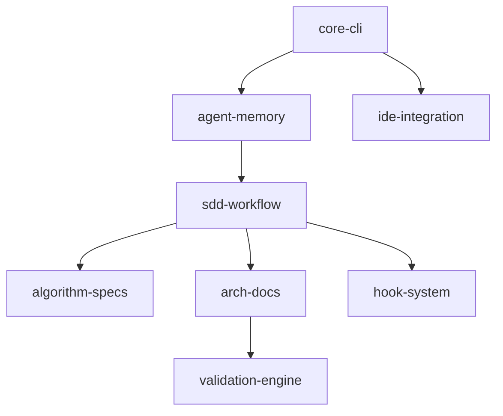

# Features Manifest: agent-scope

## Feature List

| Slug                | Feature Name                        | Status      | Dependencies   |
| ------------------- | ----------------------------------- | ----------- | -------------- |
| `core-cli`          | Core CLI Infrastructure             | COMPLETE    | None           |
| `agent-memory`      | Agent Memory & Roles                | COMPLETE    | `core-cli`     |
| `sdd-workflow`      | Spec-Driven Development Workflow    | COMPLETE    | `agent-memory` |
| `algorithm-specs`   | Logic Flow Algorithm Specifications | PLANNED     | `sdd-workflow` |
| `arch-docs`         | Hierarchical Design Documentation   | PLANNED     | `sdd-workflow` |
| `validation-engine` | Enhanced Validation System          | PLANNED     | `arch-docs`    |
| `hook-system`       | Hook System (Pre/Post Tool Use)     | PLANNED     | `sdd-workflow` |
| `ide-integration`   | IDE & AI Tool Integration           | IN-PROGRESS | `core-cli`     |

## Dependency Graph

